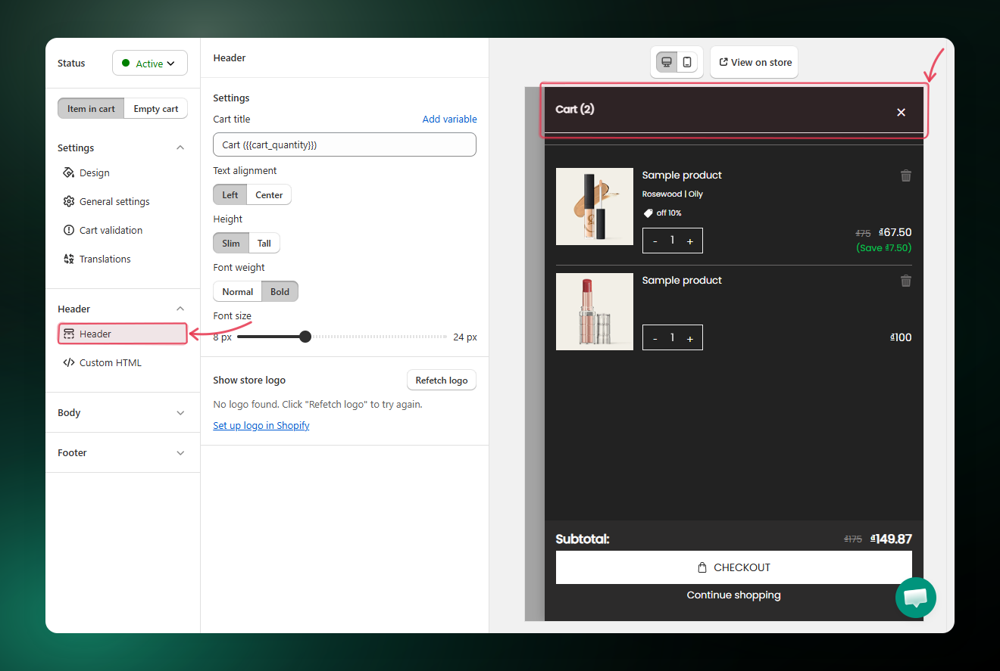
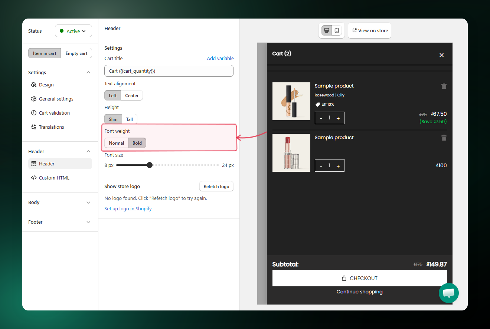

# Header

What is Header?

The **Header** is the top section of your cart drawer. It shows your cart title (with the live item count) so customers know exactly what they are looking at the moment the drawer opens.

How to set up?

#### Step 1: Open the Header settings

1. Go to **AOV.ai Cart Drawer > Cart Editor**.
2. In the left settings menu, click **Header**.

The Header settings panel appears on the left, with the live cart preview on the right.

<figure><figcaption></figcaption></figure>

#### Step 2: Set the cart title

The **Cart title** is the text that appears at the top of the drawer

1. In the **Cart title** field, enter the text you want to display.
2. (Optional) Click **Add variable** and insert `{{cart_quantity}}` to show the live item count next to your title.

<figure><figcaption></figcaption></figure>

#### Step 3: Choose the text alignment

Decide where the cart title sits in the header.

* **Left** — title aligns to the left of the drawer.
* **Center** — title sits in the middle of the drawer.

<figure><figcaption></figcaption></figure>

#### Step 4: Set the font weight

Pick how thick the title text should look.

* **Normal** — standard weight, lighter look.
* **Bold** — heavier weight, stronger emphasis.

<figure><figcaption></figcaption></figure>

#### Step 5: Adjust the font size

Drag the **Font size** slider to set the title size between **8 px** and **24 px**. Use the live preview on the right to find the size that fits your design.

<figure><figcaption></figcaption></figure>

Once the header looks the way you want, click **Save** at the top right to apply your changes.
